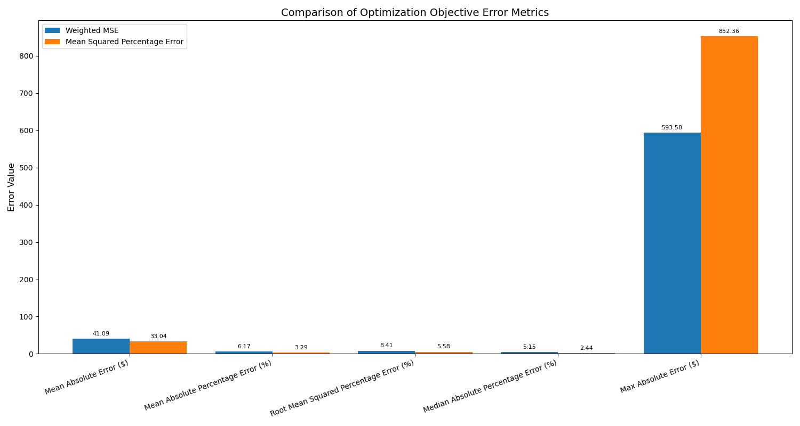

# Pricing Matrix Decomposition

This project solves the pricing matrix decomposition problem, aiming to determine a vector of 30 nightly base rates and corresponding discount tier structures that best reconstruct a given 30x30 matrix of stay prices.

## Problem Description
Given a 30×30 upper-triangular matrix of stay prices where:
- Rows 1-30 represent check-in days within a month (Day 1 to Day 30).
- Columns 1-30 represent lengths of stay in nights (1 to 30).
- Cell (i,j) holds the price for a stay beginning on Day i and lasting j nights.

We need to find the base rates and discount tiers that minimize the discrepancy between the prices calculated from these components and the target input matrix.

## Solution Approach

### 1. Objective Functions
The script now supports and runs three distinct objective functions to find the optimal base rates and discounts:
- **Weighted Mean Squared Error (WMSE):** This objective minimizes the sum of squared differences between calculated and target prices, weighted by the inverse square root of the target price. This gives more importance to fitting lower-priced items accurately in absolute terms, while still penalizing large errors.
- **Mean Squared Percentage Error (MSPE):** This objective minimizes the sum of squared *percentage* differences between calculated and target prices. This is useful for ensuring that the relative error is small across all price points.
- **Asymmetric Powered Percentage Error (APPE):** A novel objective function that applies asymmetric weighting to percentage errors, heavily penalizing overpricing (predicted > actual) more than underpricing. The errors are raised to a power (k=3) to emphasize larger deviations, making it particularly suitable for revenue optimization in pricing contexts.

The script runs the optimization process for all three objectives sequentially and provides comparative analysis.

### 2. Decision Variables and Constraints
- **Base rates (30 variables)**: One for each day, constrained to be positive.
- **Discounts (30 × 8 variables)**: Discount percentages for each day and for 8 predefined length-of-stay cutoffs (2, 3, 4, 5, 6, 7, 14, 28 days).
- **Constraints**:
  - Discounts must be between 0.01 and 0.99 (1% to 99%).
  - For each day, discounts must be non-decreasing with the length-of-stay cut-off.

### 3. Optimization Technique 🛠️
For each objective function, the primary optimization algorithm used is **SLSQP (Sequential Least Squares Programming)** from SciPy's `minimize` function. 
- It's well-suited for problems with bounds and non-linear constraints.
- If SLSQP doesn't yield a satisfactory result (based on an objective-specific error metric) or fails, the system automatically falls back to **COBYLA (Constrained Optimization BY Linear Approximation)**, and then to **Nelder-Mead** as a final attempt to find a robust solution for that objective.

### 4. Computational Complexity
- The problem has 30 (base rates) + (30 × 8) (discounts) = 270 decision variables.
- The objective function calculation involves iterating through the price matrix, roughly O(n²) where n is the number of days (30).
- The optimization typically converges in several dozen to a few hundred iterations for each objective.
- Memory usage is moderate, primarily for storing the pricing matrix and intermediate optimization arrays.

### 5. Penalty Coefficients Configuration 🔧
Each objective function uses configurable penalty coefficients to enforce different constraints:
- **Non-monotonic penalty**: Enforces that discounts increase with length of stay
- **Regularization penalty**: Prevents overfitting by penalizing large parameter values
- **Boundary penalty**: Keeps variables within valid bounds

The penalty coefficients are optimized per objective:
- **WMSE**: High penalties (1e6, 1e-4, 1e4) for strict constraint enforcement
- **MSPE**: Moderate penalties (100.0, 1e-8, 1.0) for balanced optimization
- **APPE**: Conservative penalties (100.0, 1e-8, 100.0) for stable convergence

### 6. Recent Improvements 🚀
- **Fixed APPE evaluation**: Resolved infinite error metrics by properly implementing APPE error calculation
- **Configurable penalties**: Made penalty coefficients adjustable per objective for better tuning
- **Enhanced robustness**: Added input validation and diagnostic logging throughout the optimization pipeline
- **Improved convergence**: Reduced boundary penalties for APPE to achieve stable optimization results

### 7. Performance Results 📊

The system has been tested with all three objectives and produces the following comparative results:

| Metric | Weighted MSE (WMSE) | Mean Squared Percentage Error (MSPE) | Asymmetric Powered Percentage Error (APPE) |
|--------|---------------------|----------------------------------------|---------------------------------------------|
| MAE (Mean Absolute Error) | $41.09 | $33.04 | $68.98 |
| MSE (Mean Squared Error) | 5766.31 | 9098.36 | 15187.84 |
| MAPE (Mean Abs. % Error) | 6.17% | 3.29% | 7.96% |
| MedAPE (Median Abs. % Error) | 5.15% | 2.44% | 6.57% |
| RMSPE (Root Mean Sq. % Err.) | 8.41% | 5.58% | 10.25% |
| Max Absolute Error | $593.58 | $852.36 | $852.06 |
| Convergence (Iterations) | 165 | 97 | 18 |

**Key Findings:**
- **MSPE** achieves the best percentage-based accuracy (3.29% MAPE, 5.58% RMSPE)
- **WMSE** provides the best absolute accuracy ($41.09 MAE)
- **APPE** converges fastest (18 iterations) and successfully avoids overpricing through asymmetric penalties

### 8. Validation and Error Reporting 📉
For each optimization objective run, the script calculates and reports:
- Mean Absolute Error (MAE)
- Mean Squared Error (MSE)
- Mean Absolute Percentage Error (MAPE)
- Median Absolute Percentage Error (MedAPE)
- Root Mean Squared Percentage Error (RMSPE)
- Maximum Absolute Error

## How to Run

1.  **Environment Setup**: It's recommended to use a virtual environment.
    ```bash
    python3 -m venv venv
    source venv/bin/activate  # On Linux/macOS
    # venv\Scripts\activate  # On Windows
    ```
2.  **Install Dependencies**:
    ```bash
    pip install -r requirements.txt
    ```
3.  **Input Data**: Place your `pricing_matrix_30x30.csv` file (or a similarly structured CSV) in the project directory. The script expects the first column to be an index (e.g., day numbers) and the header row to represent lengths of stay.
4.  **Run the Script**:
    ```bash
    python3 pricing_decomposition.py
    ```
    (Use `py pricing_decomposition.py` on Windows if `python3` is not aliased or `python` points to an older version).

5.  **Outputs**: The script will:
    *   Load the input pricing matrix.
    *   Run the optimization process sequentially for both WMSE, MSPE, and APPE objectives.
    *   For each objective, save detailed results to CSV files, with suffixes like `_wmse`, `_mspe`, or `_appe` (e.g., `vector_wmse.csv`, `discounts_mspe.csv`, `vector_appe.csv`).
    *   Generate and save visualizations as PNG files, also with corresponding suffixes (e.g., `base_rates_wmse.png`, `base_rates_mspe.png`, `base_rates_appe.png`).
    *   Generate a final `error_metrics_comparison.png` plot comparing key error metrics across all run objectives.

## Output Files 📂

Output files are generated for each objective function and are distinguished by a suffix (e.g., `_wmse`, `_mspe`, `_appe`).

**CSV Files (per objective):**
- `vector{suffix}.csv`: Contains the 30 derived base rates.
- `discounts{suffix}.csv`: A 30x8 matrix showing discount percentages for each day and LOS tier.
- `price_comparison{suffix}.csv`: Lists original prices, calculated prices, and absolute errors.

**Image Files (Visualizations - PNG, per objective):**
- `original_prices.png`: Heatmap of the input pricing matrix (generated once).
- `base_rates{suffix}.png`: Line plot of derived base rates.
- `discount_curves{suffix}.png`: Line plots of discount structures.
- `calculated_prices{suffix}.png`: Heatmap of the reconstructed price matrix.
- `error_heatmap{suffix}.png`: Heatmap of absolute errors.

**Comparison Image File (PNG):**
- `error_metrics_comparison.png`: A bar chart comparing key error metrics (MAE, MAPE, RMSPE) between the WMSE, MSPE, and APPE optimization runs.

## Dependencies
- Python 3.8+
- numpy
- pandas
- scipy
- matplotlib
- seaborn
- pulp (listed in requirements, though direct usage might vary)

## Example Results (with `pricing_matrix_30x30.csv`)

The following table summarizes the typical error metrics achieved when running the script with the provided `pricing_matrix_30x30.csv` example data for both the Weighted MSE (WMSE) and Mean Squared Percentage Error (MSPE) objectives:

| Metric                       | Weighted MSE (WMSE) | Mean Squared Percentage Error (MSPE) |
| :--------------------------- | :------------------: | :------------------------------------: |
| MAE (Mean Absolute Error)    |        $41.09       |                 $33.04                 |
| MSE (Mean Squared Error)     |       5766.31       |                9098.36                 |
| MAPE (Mean Abs. % Error)   |        6.17%         |                 3.29%                  |
| MedAPE (Median Abs. % Error) |        5.15%         |                 2.44%                  |
| RMSPE (Root Mean Sq. % Err.) |        8.41%         |                 5.58%                  |
| Max Absolute Error           |       $593.58       |                $852.36                 |

*Note: These values are based on a specific run and may vary slightly due to the stochastic nature of some optimization aspects or minor code changes.*

**Visual Comparison of Error Metrics:**

The `error_metrics_comparison.png` plot provides a visual summary of key performance indicators:



This comparison helps in choosing the objective function that best aligns with specific business priorities (e.g., minimizing absolute vs. percentage errors).
