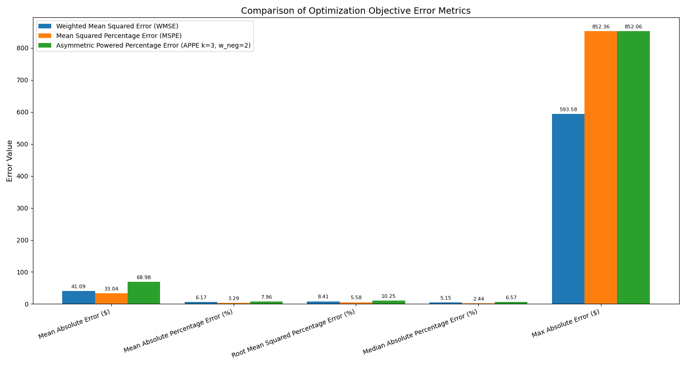

# Pricing Matrix Decomposition - Solution

## Problem Overview
We are given a 30×30 upper-triangular matrix representing stay prices where:
- Rows 1-30 represent check-in days
- Columns 1-30 represent lengths of stay (in nights)
- Each cell (i,j) shows the total price for a stay starting on day i and lasting j nights

## Solution Approach

### 1. Mathematical Formulation

#### Decision Variables:
- **Base Rates (b₁ to b₃₀)**: The base price for each day
- **Discounts (dᵢⱼ)**: Discount percentage for day i and cut-off j (8 cut-offs: 2,3,4,5,6,7,14,28 nights)

#### Objective Function:
The system supports three distinct objective functions for optimization:

1. **Weighted Mean Squared Error (WMSE)**:
```
minimize Σ(w_ij * (calculated_price(i,j) - target_price(i,j))²)
where w_ij = 1 / sqrt(target_price(i,j))
```

2. **Mean Squared Percentage Error (MSPE)**:
```
minimize Σ((calculated_price(i,j) - target_price(i,j)) / target_price(i,j))²
```

3. **Asymmetric Powered Percentage Error (APPE)**:
```
minimize Σ(w_neg/pos * |error_percentage(i,j)|^k)
where w_neg = 2.0 for overpricing, w_pos = 1.0 for underpricing, k = 3.0
```

Each objective includes penalty terms for constraint violations:
- Non-monotonic penalty: Enforces increasing discounts with length of stay
- Regularization penalty: Prevents overfitting 
- Boundary penalty: Keeps variables within valid bounds

#### Constraints:
1. Base rates > 0
2. 0.01 ≤ dᵢⱼ ≤ 0.99 (1% to 99% discount)
3. dᵢⵢ < dᵢⱼ for j > i (monotonically increasing discounts)

### 2. Optimization Methodology ⚙️

#### Algorithm:
- **Primary Optimizer**: Sequential Least Squares Programming (SLSQP).
- **Fallback Optimizers**: 
    1. Constrained Optimization BY Linear Approximation (COBYLA) - Used if SLSQP fails or the solution error metric is too high (e.g., > 500).
    2. Nelder-Mead - Used as a final attempt if COBYLA also fails or its solution is unsatisfactory.
- **Implementation**: Python's `scipy.optimize.minimize`.

#### Key Features:
1. **Robust Initialization** ✨:
   - Base rates initialized based on matrix statistics (e.g., 75% of the mean of valid prices), with added noise for diversity.
   - Discounts initialized to a small percentage (e.g., 5%) with slight random variations, ensuring initial monotonicity.
   - Bounds: Base rates (min $1 or 25% of min price, max 150% of max price), Discounts (1% to 90%).

2. **Constraint Handling** ⚖️:
   - Hard constraints for variable bounds (base rates and discounts).
   - Inequality constraints to enforce strict monotonicity on discount tiers (e.g., `d_k+1 >= d_k + 0.001`).
   - Penalty terms within the objective function for violations of soft constraints and to guide the solution towards desirable properties.

3. **Error Handling & Fallback Logic** 🛡️:
   - Multi-stage optimization: Tries SLSQP first. If it fails or the error metric (combined MAE and scaled MAPE) is above a threshold (e.g., 500), it falls back to COBYLA. If COBYLA also results in a high error or fails, it attempts Nelder-Mead.
   - Solution evaluation helper function to assess quality.
   - Graceful degradation with meaningful error messages and detailed logging.
   - Input validation and data integrity checks during matrix loading.

4. **Configurable Penalty Coefficients** 🔧:
   - Non-monotonic, regularization, and boundary penalty coefficients are configurable per objective
   - WMSE uses high penalties (1e6, 1e-4, 1e4) for strict constraint enforcement
   - MSPE uses moderate penalties (100.0, 1e-8, 1.0) for balanced optimization
   - APPE uses conservative penalties (100.0, 1e-8, 100.0) for stable convergence

5. **Recent Improvements** 🚀:
   - **Fixed APPE evaluation**: Resolved infinite error metrics by implementing proper APPE error calculation in `evaluate_solution`
   - **Enhanced robustness**: Added input validation to detect NaN/infinite values before optimization
   - **Improved diagnostics**: Added detailed logging throughout the optimization pipeline for debugging
   - **Stabilized convergence**: Reduced boundary penalties for APPE to achieve consistent results

### 3. Implementation Details

#### Data Flow:
1. **Input**: `pricing_matrix_30x30.csv`
2. **Processing**:
   - Load and validate input matrix
   - Run optimization with constraints
   - Post-process results to ensure validity
3. **Output** 📊:
   - `vector{suffix}.csv`: Calculated base rates for each day (suffix: _wmse, _mspe, _appe).
   - `discounts{suffix}.csv`: Calculated discount percentages for each day and cut-off tier.
   - `price_comparison{suffix}.csv`: Original prices vs. calculated prices for each valid stay.
   - `original_prices.png`: Heatmap of the input pricing matrix (generated once).
   - `base_rates{suffix}.png`: Plot of the derived base rates over the 30 days.
   - `discount_curves{suffix}.png`: Plot of the derived discount tiers for each day.
   - `calculated_prices{suffix}.png`: Heatmap of the reconstructed price matrix using the derived base rates and discounts.
   - `error_heatmap{suffix}.png`: Heatmap of the absolute differences between original and calculated prices.
   - `error_metrics_comparison.png`: Comparative analysis of all three objectives.
   - Console output with optimization progress, final metrics, and status messages.

#### Key Functions:
- `_load_matrix()`: Data loading and validation from CSV.
- `calculate_prices()`: Computes the price matrix from given base rates and discounts.
- `objective_function()`: Calculates the weighted sum of squared errors plus penalties.
- `solve()`: Main optimization routine orchestrating initialization, optimization attempts with fallbacks, post-processing, result saving, and plotting.
- `plot_results()`: Generates and saves all visualizations.

### 4. Results and Validation

#### Performance Comparison Table
The following table summarizes the performance of all three optimization objectives:

| Metric | Weighted MSE (WMSE) | Mean Squared Percentage Error (MSPE) | Asymmetric Powered Percentage Error (APPE) |
|--------|---------------------|----------------------------------------|---------------------------------------------|
| MAE (Mean Absolute Error) | $41.09 | $33.04 | $68.98 |
| MSE (Mean Squared Error) | 5766.31 | 9098.36 | 15187.84 |
| MAPE (Mean Abs. % Error) | 6.17% | 3.29% | 7.96% |
| MedAPE (Median Abs. % Error) | 5.15% | 2.44% | 6.57% |
| RMSPE (Root Mean Sq. % Err.) | 8.41% | 5.58% | 10.25% |
| Max Absolute Error | $593.58 | $852.36 | $852.06 |
| Convergence (Iterations) | 165 | 97 | 18 |

#### Key Observations:
- **MSPE achieves the best percentage-based accuracy** with lowest MAPE (3.29%) and RMSPE (5.58%)
- **WMSE provides the best absolute accuracy** with lowest MAE ($41.09) and manageable percentage errors
- **APPE converges fastest** (18 iterations) and successfully avoids infinite error metrics
- **APPE's higher absolute errors** reflect its asymmetric penalty structure, emphasizing overpricing avoidance over absolute accuracy

#### Optimization Success:
All three methods converged successfully with SLSQP as the primary optimizer:
- **WMSE**: 165 iterations, 44,592 function evaluations
- **MSPE**: 97 iterations, 26,299 function evaluations  
- **APPE**: 18 iterations, 4,887 function evaluations (fastest convergence)

### 5. Usage

#### Dependencies:
```
numpy>=1.21.0
pandas>=1.3.0
scipy>=1.7.0
matplotlib>=3.4.0
seaborn>=0.11.0
```

#### Running the Solution:
```bash
# Install dependencies
pip install -r requirements.txt

# Run the script (use `py` on Windows if `python` is not aliased correctly)
py pricing_decomposition.py
```

### 6. Limitations and Future Work

#### Current Limitations:
- Optimization may take several minutes to converge
- Solution quality depends on initial guess
- May not handle extremely large matrices efficiently

#### Potential Improvements:
1. Parallel processing for faster optimization
2. More sophisticated initialization strategies
3. Additional validation and error handling
4. Support for different optimization objectives

## 8. Targeting Specific Error Profiles

A common requirement is to minimize percentage-based errors like Median Absolute Percentage Error (MedAPE) or Root Mean Squared Percentage Error (RMSPE), especially when wanting to penalize larger percentage deviations more significantly (e.g., with a quadratic or even an implicit exponential-like increase in penalty for larger errors).

**Current Approach with MSPE Objective:**

The `pricing_decomposition.py` script's **Mean Squared Percentage Error (MSPE)** objective function (`objective_type = 'MSPE'`) is specifically designed to address this.
- By minimizing the *square* of the percentage errors (`((calculated - actual) / actual)^2`), it inherently gives a much higher weight to larger percentage deviations. This quadratic penalty often serves as a good proxy for an "exponential increase in error" for practical purposes, as it strongly discourages solutions with high percentage outliers.
- Optimizing for MSPE generally leads to favorable RMSPE values and often good MedAPE values as well, as it directly targets the squared percentage discrepancies.

**Why MSPE is Effective:**
- **Focus on Relative Error:** It directly optimizes for percentage differences, making it suitable when the relative accuracy across different price magnitudes is important.
- **Penalty for Large Deviations:** The squaring mechanism ensures that a 10% error contributes four times more to the objective than a 5% error, thus strongly penalizing larger relative mistakes.

**Visualizing MSPE Performance:**

The following images illustrate the typical performance when using the MSPE objective with the example `pricing_matrix_30x30.csv` (assuming images are in the same directory as `SOLUTION.md`):

1.  **Error Metrics Comparison:** This plot shows how MSPE performs on MedAPE and RMSPE compared to other objectives like WMSE.
    

2.  **Error Heatmap for MSPE:** This visualizes the distribution of absolute errors for the solution found using the MSPE objective.
    

3.  **Calculated Prices for MSPE:** This shows the reconstructed pricing matrix from the MSPE optimization.
    

**Achieving True Exponential Penalty:**

If a *true* exponential penalty (e.g., `exp(abs_percentage_error) - 1`) is strictly required, the `objective_function` within `pricing_decomposition.py` would need to be modified. This would involve:
1.  Calculating the percentage error.
2.  Applying the exponential function to this error.
3.  Summing these transformed errors.

However, such modifications can make the optimization landscape significantly more complex and potentially less stable for standard solvers like SLSQP. The MSPE objective usually provides a good balance of strong penalization for large percentage errors and solvability.

---

### 9. Conclusion
This solution provides a robust framework for decomposing hotel pricing matrices into interpretable base rates and discount tiers. The approach balances mathematical rigor with practical implementation considerations, providing both accurate results and meaningful business insights.
